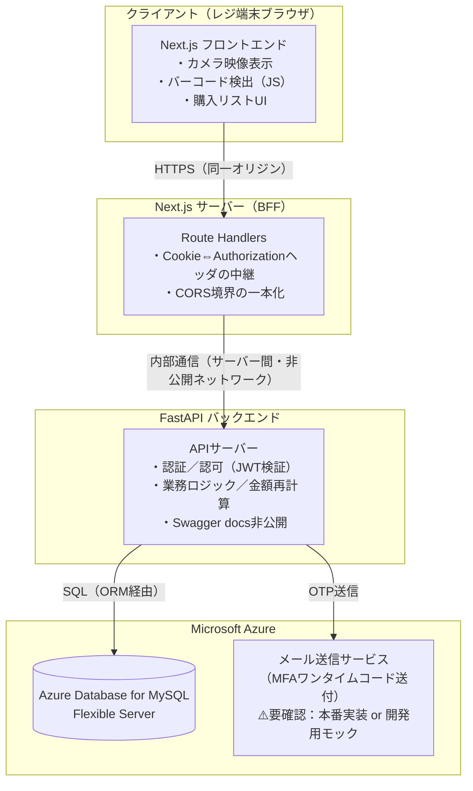
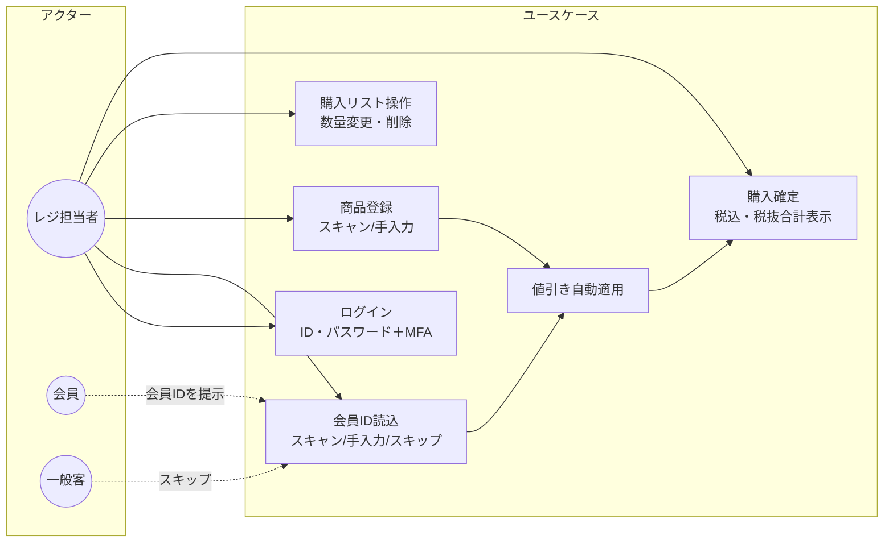
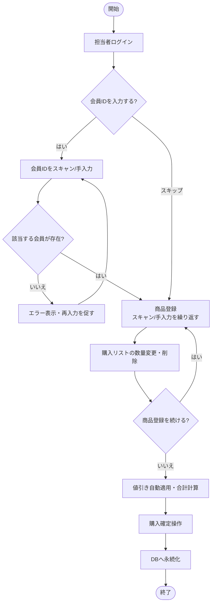
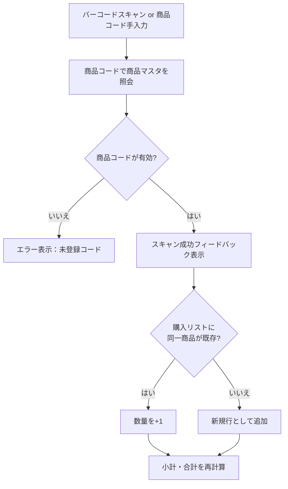
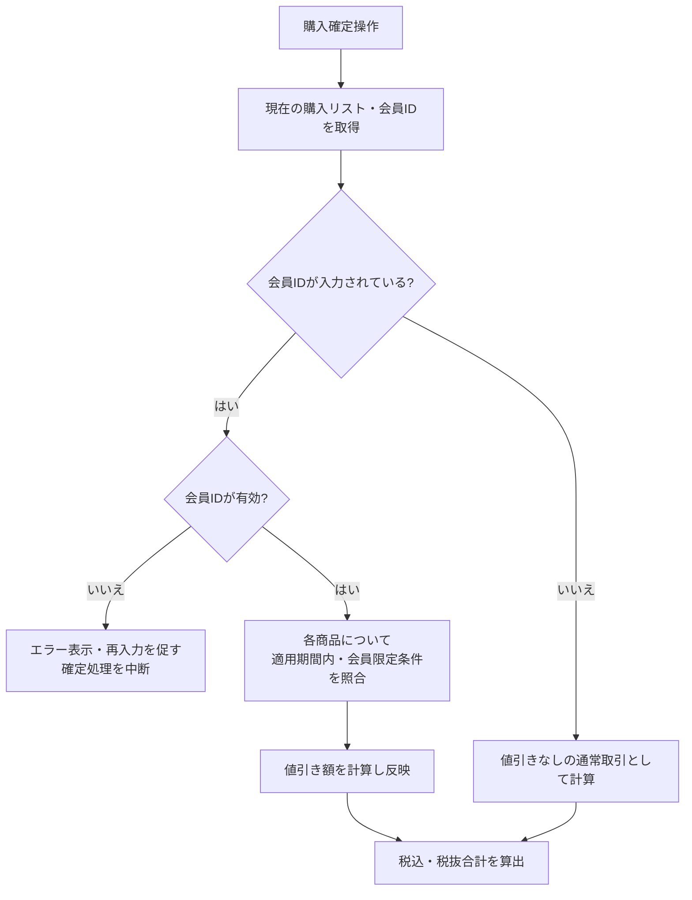
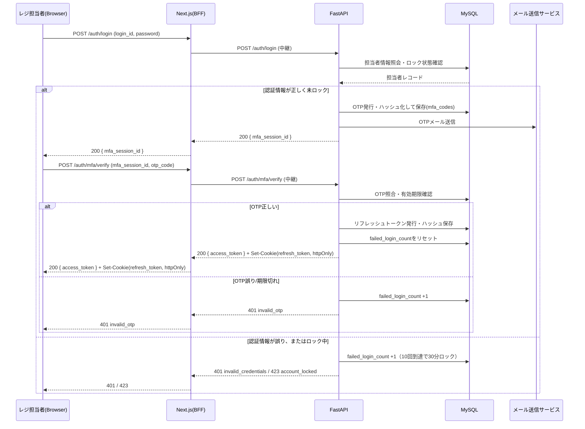
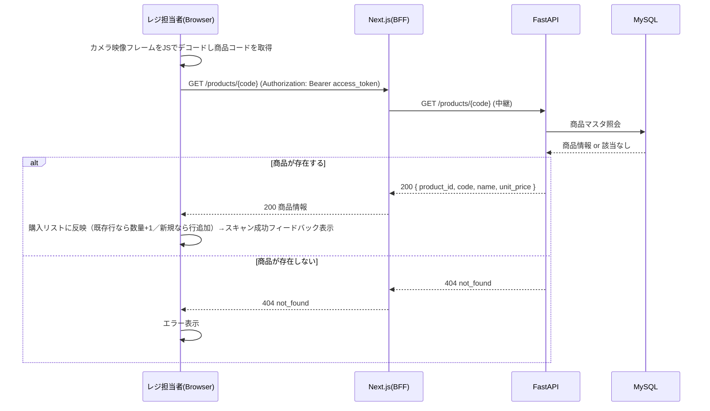
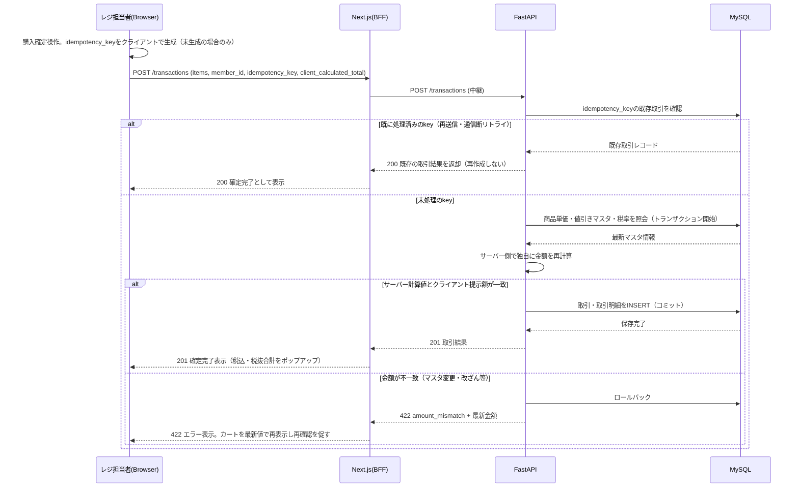
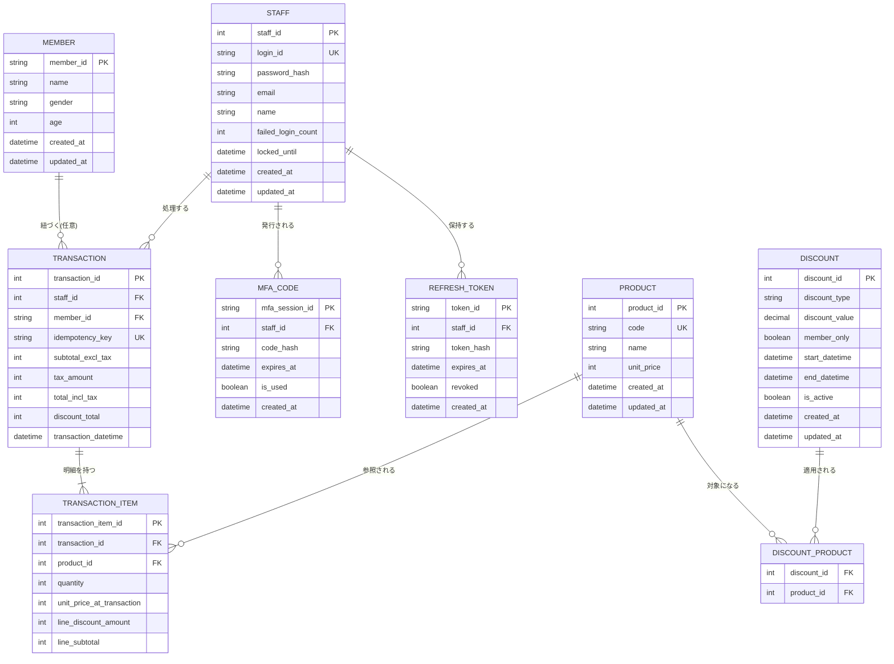

# ベーカリー向け簡易POSアプリ 設計仕様書（Lv2）

- 対象課題：Tech0プログラム 簡易POSアプリ課題（Lv2）
- 元資料：`requirements.md`（確定版・要件定義書）
- 本書のステータス：**ドラフト（要レビュー）**
- 生成AI利用について：Claude（Anthropic）との対話により、要件定義書をもとにした設計方針の整理・UML/ER図の作成・API設計・文書化を行った。要件定義書に明記された内容はすべて確定事項として扱い、要件定義書に記載のない実装方式（アーキテクチャ選定・データ型・具体的な数値等）はClaudeによる提案であり、本文中に **⚠️要確認** として明示している。採否は人間が判断すること。

---

## 0. 設計方針

### 0.1 変更不可の前提条件（要件定義書より）

| 項目 | 内容 |
|---|---|
| アプリ形態 | Webアプリ（ブラウザ動作） |
| フロントエンド | Next.js |
| バックエンド | FastAPI |
| インフラ | Microsoft Azure |
| DB | Azure Database for MySQL Flexible Server |

### 0.2 本書作成にあたり確認・決定したアーキテクチャ方針

| 論点 | 決定内容 | 決定者 |
|---|---|---|
| JWTのセッション管理方式 | アクセストークン（メモリ保持）＋リフレッシュトークン（httpOnlyクッキー） | ユーザー確定 |
| BFF（リバースプロキシ）構成 | Next.jsのRoute HandlersをBFFとして使用（Frontend内で完結、追加インフラなし） | Claude提案（要件定義書に記載なし・追加インフラ不要な構成を優先） |
| バーコードのデコード処理 | クライアント側（ブラウザ内JS）でカメラ映像から検出。ハードウェアスキャナー方式は不採用 | Claude提案（理由：要件2.1「カメラ映像エリアの常時表示」がハードウェアスキャナー方式と矛盾するため） |

この3点の理由・詳細は §1、§4.2、§8 に記載する。

### 0.3 本書全体で使う記法

- ⚠️要確認：要件定義書に明記がなく、Claudeが仮決めした箇所。§11に一覧化。
- 図はすべてMermaid記法。GitHub上でそのままレンダリングされる。

---

## 1. システム構成（アーキテクチャ図）



**BFFの役割**：ブラウザからは常にNext.jsサーバー（同一オリジン）にのみアクセスさせ、FastAPIへは直接到達させない。これにより、FastAPI側のCORS許可オリジンをNext.jsサーバーのみに絞れる（ブラウザから任意オリジンでFastAPIを叩かれるリスクを下げる）。またリフレッシュトークン（httpOnlyクッキー）の発行・送出をNext.jsサーバー側で中継することで、クッキーのSameSite/Domain設定をシンプルに保てる。

---

## 2. ユースケース図



店舗管理者は要件定義書1.1のとおり本アプリのスコープ外のため、ユースケース図には含めていない。

---

## 3. 業務フロー（アクティビティ図）

### 3.1 レジ業務全体フロー



### 3.2 商品登録ロジック（スキャン/手入力共通）



### 3.3 値引き判定ロジック

要件2.4「値引き判定は会員IDの入力タイミングに依存せず、購入確定前に商品と会員の状態を照合して行う」を反映し、判定は**購入確定操作のタイミングで一括して**行う設計とする。



---

## 4. シーケンス図

### 4.1 ログイン（ID・パスワード＋MFA）



### 4.2 商品バーコードスキャン→購入リスト反映



### 4.3 購入確定（値引き・税計算の再検証と永続化）



**設計意図（講義ヒント「Backendでも計算ロジックを入れ、Frontendの計算値と照合」への対応）**：フロントエンドは購入リスト操作中、直近に取得した商品単価・値引き情報を用いて小計・合計をその場で計算し画面表示する（体感速度優先）。購入確定時にはその計算結果を`client_calculated_total`としてバックエンドに送信し、バックエンドは商品マスタ・値引きマスタ・税率を**都度DBから取得し直して独自に再計算**、両者を照合したうえで一致した場合のみ確定処理を行う。これにより、フロントエンドの改ざん（DevTools等での送信値の書き換え）や、カート表示後にマスタが変更された場合の不整合を検知できる。

---

## 5. データモデル（ER図）



### 5.1 テーブル定義補足

**staff（担当者）**
| カラム | 型 | 制約・備考 |
|---|---|---|
| staff_id | INT | PK, AUTO_INCREMENT |
| login_id | VARCHAR(50) | UNIQUE, NOT NULL |
| password_hash | VARCHAR(255) | bcrypt等でハッシュ化。平文は保持しない |
| email | VARCHAR(255) | MFA送付先 |
| name | VARCHAR(100) | |
| failed_login_count | INT | DEFAULT 0。パスワード誤りとOTP誤りを合算してカウント ⚠️要確認 |
| locked_until | DATETIME | NULL可。10回失敗到達時に現在時刻+30分をセット |

**member（会員）**：要件3.1「電話番号・住所は取得しない」を反映し、氏名・性別・年齢のみを保持。年齢は要件定義書の記載通り年齢そのものを保持する設計とした（誕生日から都度算出する方式ではない）⚠️要確認：経年で値が古くなる点を許容するか確認が必要。

**product（商品マスタ）**：本アプリの読み取り専用対象。作成・更新・削除APIは要件1.1「店舗管理者機能はスコープ外」により**設計しない**。マスタの初期投入・更新は本アプリ外（DB直接操作等）で行う前提。`code`は個包装商品のバーコード、または対面パンの商品コード一覧表（早見表）に印字されたバーコードのいずれかで、システム上は同一の`code`として扱う。⚠️要確認：バーコード規格をJANコード（8/13桁）と仮定。

**discount（値引きマスタ）**：`discount_type`は`'rate'`（定率、`discount_value`を%として解釈）または`'amount'`（定額、`discount_value`を円として解釈）。対象商品は`discount_product`で多対多。⚠️要確認：同一商品・同一期間に複数の有効な値引きが重複設定された場合の優先順位（本書では「マスタ運用上重複させない」ことを前提とし、万一重複時は割引額が最大のものを適用するフェイルセーフのみ実装する想定）。

**transaction / transaction_item（取引・取引明細）**：要件2.5「確定済み取引の単価は商品マスタの単価変更で改変されない」に対応するため、`transaction_item.unit_price_at_transaction`に確定時点の単価をスナップショットする（`product`テーブルの`unit_price`を直接参照しない）。要件3.2「取引は担当者・日時・商品・数量・金額・値引き有無を後から追跡できる」は本テーブル構成（`staff_id`・`transaction_datetime`・明細）で充足する。

**mfa_code / refresh_token**：OTP・リフレッシュトークンともに平文はDBに保存せずハッシュ化して保存する（漏えい時の悪用を防ぐ）。

---

## 6. API設計

### 6.1 API一覧表

| # | メソッド | パス | 概要 | 認証 |
|---|---|---|---|---|
| 1 | POST | /api/auth/login | ID・パスワード認証、成功時OTP送信 | 不要 |
| 2 | POST | /api/auth/mfa/verify | OTP検証、アクセストークン発行 | 不要（mfa_session_idで一時識別） |
| 3 | POST | /api/auth/refresh | リフレッシュトークンでアクセストークン再発行 | リフレッシュトークン（Cookie） |
| 4 | POST | /api/auth/logout | リフレッシュトークン失効 | アクセストークン |
| 5 | GET | /api/members/{member_id} | 会員情報照会（会員ID読込時の存在確認） | アクセストークン |
| 6 | GET | /api/products/{code} | 商品コードから商品情報取得（スキャン/手入力共通） | アクセストークン |
| 7 | POST | /api/transactions | 購入確定（サーバー側再計算・永続化） | アクセストークン |

商品マスタ・値引きマスタ・税率の作成/更新/削除APIは要件定義書1.1により本アプリのスコープ外のため一覧に含めない。

### 6.2 API詳細

#### 1. POST /api/auth/login
リクエスト
```json
{ "login_id": "string", "password": "string" }
```
レスポンス（200）
```json
{ "mfa_session_id": "uuid", "expires_in": 300 }
```
エラー：`401 invalid_credentials` / `423 account_locked`（`locked_until`を含む）

#### 2. POST /api/auth/mfa/verify
リクエスト
```json
{ "mfa_session_id": "uuid", "otp_code": "string(6桁)" }
```
レスポンス（200、`Set-Cookie: refresh_token=...; HttpOnly; Secure; SameSite=Strict`）
```json
{ "access_token": "jwt", "token_type": "Bearer", "expires_in": 900 }
```
エラー：`401 invalid_otp` / `410 mfa_session_expired`

#### 3. POST /api/auth/refresh
レスポンス（200）：`access_token`を再発行。エラー：`401 invalid_or_revoked_refresh_token`

#### 4. POST /api/auth/logout
レスポンス：`204 No Content`。リフレッシュトークンをDB上で失効（`revoked=true`）、Cookieを削除。

#### 5. GET /api/members/{member_id}
レスポンス（200）
```json
{ "member_id": "string", "name": "string", "gender": "string", "age": 0 }
```
エラー：`404 member_not_found`（要件2.4「該当する会員が存在しない場合はエラー表示・再入力」に対応）

#### 6. GET /api/products/{code}
レスポンス（200）
```json
{ "product_id": 0, "code": "string", "name": "string", "unit_price": 0 }
```
エラー：`404 product_not_found`

#### 7. POST /api/transactions
リクエスト
```json
{
  "idempotency_key": "uuid",
  "member_id": "string|null",
  "items": [ { "product_id": 0, "quantity": 1 } ],
  "client_calculated_total": {
    "subtotal_excl_tax": 0,
    "tax_amount": 0,
    "total_incl_tax": 0,
    "discount_total": 0
  }
}
```
レスポンス（201）
```json
{
  "transaction_id": 0,
  "staff_id": 0,
  "member_id": "string|null",
  "items": [
    { "product_id": 0, "name": "string", "quantity": 1, "unit_price": 0, "line_discount_amount": 0, "line_subtotal": 0 }
  ],
  "subtotal_excl_tax": 0,
  "tax_amount": 0,
  "total_incl_tax": 0,
  "discount_total": 0,
  "transaction_datetime": "ISO8601"
}
```
エラー：`422 amount_mismatch`（最新の`server_calculated_total`を含めて返却）／`400 invalid_item`（商品コード不正・数量が1〜99の範囲外等）／`409 idempotency_conflict`（同一keyで内容が異なるリクエストが来た場合）

---

## 7. 画面設計

### 7.1 画面構成（要件2.1を反映）

単一画面（レジ操作画面）構成とし、以下のコンポーネントで構成する。

| コンポーネント | 内容 |
|---|---|
| ヘッダー | ログイン中担当者名の表示、ログアウト操作 |
| カメラ映像エリア | バーコードスキャン用カメラ映像を常時表示、スキャン成功時に視覚的フィードバック |
| 商品コード手入力欄 | スキャンできない場合の代替入力 |
| 会員IDエリア | 会員ID表示・入力欄（スキャン／手入力／スキップ） |
| 購入リスト | 名称・数量・単価・小計を行表示。選択中行をハイライト。値引き適用行には値引き額を表示 |
| 操作パネル | 選択行の数量変更（1〜99）・削除 |
| 購入確定ボタン／合計ポップアップ | 税込・税抜合計をポップアップ表示し、確定操作を行う |

### 7.2 フロントエンド状態管理 ⚠️要確認（React標準のuseState/useReducer等、状態管理ライブラリの指定なし）

- カート状態（購入リスト・選択行・会員情報）はページ内のローカル状態として保持し、DBへは購入確定時のみ書き込む。
- 認証状態（アクセストークン）はメモリ（Reactの状態）に保持し、ページリロード時は`/api/auth/refresh`をhttpOnlyクッキーで再実行してアクセストークンを再取得する。

---

## 8. セキュリティ設計

### 8.1 認証・認可（JWT）

- アクセストークン：JWT、有効期限 **15分** ⚠️要確認。ブラウザのメモリ（React状態）にのみ保持し、localStorage/sessionStorageには保存しない（XSS時の窃取リスク低減）。
- リフレッシュトークン：有効期限 **12時間**（開店〜閉店の1シフトを想定）⚠️要確認。`HttpOnly; Secure; SameSite=Strict`属性のクッキーとして発行し、DBには**ハッシュ化して**保存（漏えい時に再利用不可）。ログアウト・不審な利用時に個別失効可能とする。
- 認可：APIは全て（`/auth/*`を除き）Authorizationヘッダのアクセストークンを検証。担当者IDをリクエストコンテキストに紐づけ、取引記録に反映する。

### 8.2 BFF・CORS

- ブラウザはNext.jsサーバー（BFF）のみと通信し、FastAPIには直接アクセスさせない（§1参照）。
- FastAPI側のCORS許可オリジンは、Next.jsサーバーのオリジンのみに限定する（ワイルドカード`*`は使用しない）。

### 8.3 サーバー側再計算・照合

§4.3のとおり、購入確定時はクライアント提示額を鵜呑みにせず、サーバー側で商品単価・値引き・税率から独自に再計算し、一致した場合のみ確定する。

### 8.4 API仕様書（Swagger/OpenAPI）の非公開

FastAPIの`/docs`・`/redoc`・`/openapi.json`は本番環境では無効化する（`FastAPI(docs_url=None, redoc_url=None, openapi_url=None)`）。開発環境のみ有効化し、環境変数で切り替える。

### 8.5 SQLインジェクション対策

- ORM（SQLAlchemy）を使用し、生SQLの文字列結合を行わない。
- リクエスト/レスポンスはPydanticモデルで型定義し、不正な型・形式のデータをAPI境界で拒否する。
- フロントエンドはTypeScriptで型定義し、APIレスポンス・フォーム入力の型不整合をビルド時に検出する。

### 8.6 依存パッケージのバージョン管理

- Next.js・FastAPI・主要ライブラリ（SQLAlchemy、Pydantic、認証ライブラリ等）は既知の脆弱性が修正されたバージョンを使用し、`npm audit` / `pip-audit`等で定期的に脆弱性の有無を確認する運用とする ⚠️要確認（CI組み込みの要否）。

### 8.7 パスワード・ログイン試行制限

- パスワードは15文字以上（要件確定済み）、bcrypt等でハッシュ化して保存。平文保存・平文ログ出力は行わない。
- 10回連続失敗で30分ロック（要件確定済み）。`staff.failed_login_count`と`locked_until`で管理。認証成功時にカウントをリセット。

### 8.8 通信・セッションの保護

- 全通信をHTTPS化（要件確定済み）。
- クッキー属性（`HttpOnly`, `Secure`, `SameSite=Strict`）によりXSS・CSRF・盗聴によるセッション乗っ取りを防止する。

---

## 9. 入力値・エラー処理設計

### 9.1 入力値の上限・下限

| 項目 | 範囲・制約 | 根拠 |
|---|---|---|
| パスワード | 15文字以上 ⚠️上限は128文字と仮定 | 要件確定＋Claude仮定 |
| ログイン試行 | 10回失敗で30分ロック | 要件確定 |
| OTPコード | 6桁数字、有効期限5分 ⚠️要確認 | Claude仮定 |
| 購入リストの数量 | 1〜99個 | 要件確定 |
| 会員の年齢 | 0〜120 ⚠️要確認 | Claude仮定 |
| 値引き（定率） | 0〜100% | Claude仮定 |
| 値引き（定額） | 0円以上、対象商品単価以下 | Claude仮定（単価を超える値引きは業務上不整合のため） |
| 商品コード/バーコード | JANコード（8桁または13桁）を想定 ⚠️要確認 | Claude仮定 |

### 9.2 エラーハンドリング方針

- APIは`HTTPステータスコード` + `error_code`（機械可読な文字列）+ `message`（日本語、画面表示用）の形式で統一する。
- 例：
```json
{ "error_code": "member_not_found", "message": "該当する会員が見つかりません。会員IDをご確認ください。" }
```
- 画面側は`error_code`を判定してUI分岐（再入力を促す／確定ボタンを無効化する等）を行い、`message`をそのまま表示に使う。

---

## 10. 非機能要件の実現方式

### 10.1 応答速度の一定化・コールドスタート回避

- 要件3.2「リクエストごとのコールドスタート構成を避ける」に対応するため、FastAPI・Next.jsとも常時起動するホスティング構成（例：Azure App ServiceのAlways On設定）とし、サーバーレス関数（都度起動型）は採用しない ⚠️要確認：具体的なAzureサービス選定（App Service / Container Apps等）。
- DB接続はSQLAlchemyのコネクションプールを使用し、リクエストごとの接続確立コストを避ける。

### 10.2 取引の整合性（二重確定・未確定防止）

- クライアントは購入確定操作ごとに`idempotency_key`（UUID）を生成し送信する。バックエンドは同一キーの取引が既に存在する場合、新規作成せず既存結果を返す（通信断後の再送信対策）。
- 取引・取引明細の保存はDBトランザクション内で行い、途中でエラーが発生した場合は全体をロールバックする（部分的な確定を防ぐ）。
- フロントエンドは、確定APIの明示的な成功レスポンス（201）を受け取るまで「確定完了」の表示を行わない。通信断で応答を受け取れなかった場合は、同一`idempotency_key`で再送信することで安全に再試行できる。

### 10.3 バックアップ運用

- Azure Database for MySQL Flexible Serverの自動バックアップ機能を使用し、実行スケジュールを営業時間外（深夜等）に設定する ⚠️要確認：具体的な時間帯・保持期間。

---

## 11. 要確認事項一覧（総括）

本書で仮決めした項目を以下にまとめる。レビュー後、確定した内容を本書および要件定義書側に反映すること。

1. **MFAメール送信の実装レベル**：本番相当のメール送信サービス（例：Azure Communication Services）を実装するか、開発フェーズでは送信をモック化（DB記録・コンソール出力のみ）するか。
2. **failed_login_countの集計対象**：パスワード誤りのみをカウントするか、OTP誤りも合算するか。
3. **会員の年齢データ**：登録時点の年齢をそのまま保持する設計としたが、経年劣化（実年齢とのズレ）を許容するか。
4. **値引きの重複適用ルール**：同一商品・同一期間に複数の有効な値引きが設定された場合の優先順位。
5. **バーコード規格**：JANコード（8/13桁）を前提としたが、実際に使用する印刷物・商品のバーコード規格の確認。
6. **各種有効期限の具体値**：アクセストークン15分、リフレッシュトークン12時間、OTP有効期限5分とした仮の数値。
7. **パスワードの上限文字数**：128文字と仮定。
8. **会員年齢の範囲**：0〜120と仮定。
9. **消費税の端数処理ルール**：小数点以下の扱い（切り捨て/四捨五入/切り上げ）が要件定義書に未記載。本書では税込・税抜合計とも円未満切り捨てを仮の前提としているが、明記が必要。
10. **依存パッケージの脆弱性チェックの運用方法**：CI組み込みか手動確認か。
11. **ホスティング先のAzureサービス選定**：App Service / Container Apps等、Always On運用が可能な具体的なサービスの選定。
12. **DBバックアップの実行時間帯・保持期間**：具体的な設定値。
13. **バーコードデコードに使用する具体的なJSライブラリ**：ブラウザ標準の`BarcodeDetector` API を第一候補とし、非対応ブラウザ向けにポリフィル/JSライブラリ（例：ZXing系）を併用する想定だが、実際に使用する端末・ブラウザ環境の確認が必要。
